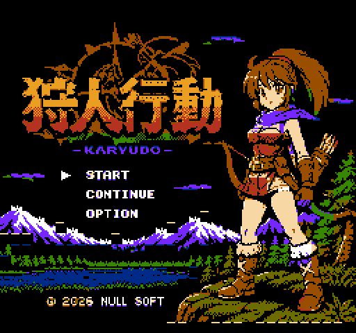
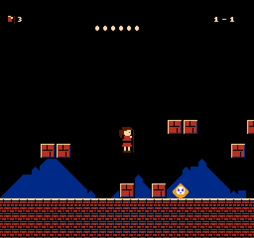
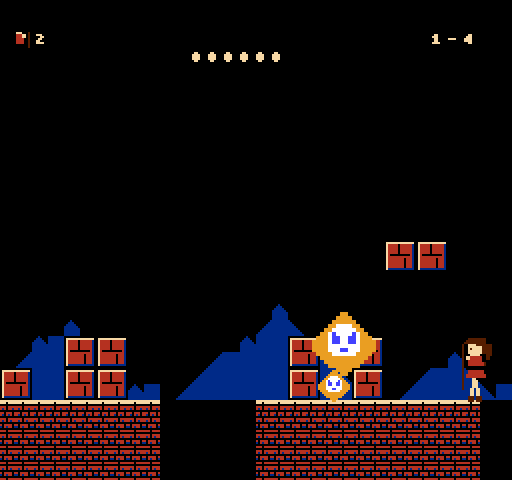

# 狩人行動 (Calude Kodo)

**狩人 (かりゅーど) の少女**が主人公のファミコン(NES)**横スクロールアクションゲーム**。6502 アセンブラ (ca65) でフルスクラッチ開発するプロジェクトです。[Claude Code](https://claude.com/claude-code) (Fable 5) と一緒にステップバイステップで作っていきます。

**▶ 遊ぶ: [cluade-famicom-emu で直接ブート](https://goroman.github.io/cluade-famicom-emu/?pin=0&debug=1&rom=https://raw.githubusercontent.com/GOROman/calude-famicom-game/main/roms/22-big-player-16f-walk.nes)** (最新版: roms/22-big-player-16f-walk.nes)

**🛠 [ステージエディタ](https://goroman.github.io/calude-famicom-game/editor/)** — ブラウザでステージを編集。URLがセーブデータになり、改造 .nes を書き出してそのまま遊べます

**🎨 [PNG→CGROM 変換ツール](https://goroman.github.io/calude-famicom-game/tools/png2chr/)** — 画像を NES の CHR データ (.byte / .chr) と 4色パレットに変換

動作確認には自作 WASM エミュレータ [cluade-famicom-emu](https://github.com/GOROman/cluade-famicom-emu) を使用。







## ストーリー

世界は「**決意マン**」に支配されてしまった。決意マンは決意する。「明日から本気を出す」「今度こそやる」「絶対にやり遂げる」——だが、決意だけして何も行動しない。

狩人カリュードは今日も行く。武器は弓ではない。「**行動**」だ。決意だけの者たちを、実際に動くことで打ち倒していく——狩人行動 (Calude Kodo)、それは行動する者の物語。

## 必要環境

- macOS (他OSでも cc65 と make があれば可)
- [cc65](https://cc65.github.io/) ツールチェーン (ca65 / ld65)

```sh
brew install cc65
```

## ビルド

```sh
make          # game.nes を生成 (iNES形式, Mapper 3 / CNROM, CHR 16KB)
make run      # cluade-famicom-emu をローカル配信してブラウザで開く
make clean
```

`make run` 後、ブラウザの「ROMを開く」から `game.nes` を読み込むと起動します。
([Web版エミュレータ](https://goroman.github.io/cluade-famicom-emu/) に直接読み込んでもOK)

## 操作方法

| 操作 | NES | キーボード (cluade-famicom-emu) |
|------|-----|------|
| 左右移動 | 十字キー ←→ | 矢印キー ←→ |
| ジャンプ (押す長さで高さが変化) | A | X |
| 弓矢 (画面内に2発まで) | B | Z |

## 構成

```
├── Makefile           # ca65/ld65 ビルド
├── nes.cfg            # ld65 リンカ設定 (PRG 32KB + CHR 8KB)
├── src/
│   ├── main.s         # エントリ・リセット処理・メインループ・NMI
│   ├── header.s       # iNES ヘッダ
│   ├── ppu.s          # PPU 初期化・画面クリア・パレット
│   ├── controller.s   # コントローラ読み取り
│   ├── player.s       # プレイヤー移動・ジャンプ物理・メタスプライト描画
│   ├── level.s        # レベルデータ・カメラ・列ストリーミング
│   ├── arrow.s        # 弓矢 (発射・飛翔・ブロック/敵への命中)
│   └── enemy.s        # 決意マン (パトロール・踏みつけ・接触判定)
├── assets/
│   └── chr.s          # CHR パターンデータ (.byte 直書き)
└── roms/              # 歴代バージョンの ROM アーカイブ
```

## 技術メモ

- **ゲームループ**: メインループで入力→更新→シャドウOAM ($0200) 書き込み → NMI (vblank) で OAM DMA 転送
- **ジャンプ物理**: スーパーマリオ風の可変ジャンプ (A の押下時間で高さが変わる)。Y 速度は 8.8 固定小数点、初速 -4.0 px/f。上昇中に A 押下中は弱い重力 ($20)、A 解放後や下降中は強い重力 ($70)、落下速度上限 4 px/f — SMB の JumpMForceData / FallMForceData / ImposeGravity と同じ方式。長押しで約62px、タップで約25px
- **プレイヤー**: 16x16 メタスプライト (8x8 x4枚)。左右反転は水平フリップ属性+タイル列入れ替え。上半身 (通常/弓を引く) と下半身 (立ち/歩き2コマ/ジャンプ) を独立に切り替えるポーズ合成方式で、歩きながらの攻撃ポーズも表現
- **横スクロール**: 垂直ミラーリングの2画面をリングとして使用。プレイヤーは16bitワールド座標で動き、カメラは画面中央 (x=120) に追従、[0, 768] でクランプ。8px境界を越えるたびに画面外の1列 (縦30タイル) を NMI 中に PPU へ縦書き転送する列ストリーミング (SMB 方式)
- **レベル**: 128列 (4画面分) を列単位のフィーチャコード (平地/柱/浮きブロック) で圧縮した `level_map` から生成
- **弓矢**: B の立ち上がりエッジで発射、ワールド座標で 4 px/f 飛翔。ブロックか敵に当たるか画面外に出ると消える (同時2発)
- **決意マン**: 地上を 0.5 px/f でパトロールし、ブロックや世界の端で折り返す。矢が当たるか上から踏むと倒せる (踏むとプレイヤーはバウンド)。地上で接触するとスタート地点に戻される。倒すとダメージ顔 (X目) → 点滅消失のアニメ後、アイテムをドロップ
- **アイテム**: 決意マンを倒すと出現。**無敵の星** = 約8.5秒無敵 (パレットサイクルで点滅、触れた敵が逆に倒れる) / **パワー矢** = 矢が 6px/f + 敵を貫通 (やられると失う)
- **クリアと残機**: 一番右 (x=1008) 到達で STAGE CLEAR! → 次のステージ。残機3機、死ぬと X 目で点滅する死亡演出 → リスポーン。0機で GAMEOVER → タイトルへ。穴 (フィーチャ5) に落ちても死ぬ
- **タイトル画面**: ドット絵イラストをフルスクリーン表示。**CNROM (マッパー3) で CHR を 16KB に拡張**し、タイトル専用バンクに512タイルを格納。**スプライト0ヒットで画面を上下スプリット**し、パターンテーブルを PT0→PT1 に切り替えて 256 タイル制限を突破。変換は自作コンバータ (12色量子化 → 4パレットのロイド式最適化 → 文字保護つきタイルマージ)。メニュー (START/CONTINUE/OPTION) はカーソルスプライトで選択、CONTINUE は前回のステージから
- **ミス時の演出**: BGM が止まり、ミスのジングルだけが鳴る。タイトル BGM はフェードイン (音量キャップ 0→15、ベースは中盤・ドラムは後半から入る段階的エントリー)
- **ボス決意マン**: 1-4 の最深部 (柱の門の先のアリーナ) に鎮座する 32x32 の大決意マン。HP8、プレイヤーへ跳びかかる。矢=1 / 踏みつけ=2 ダメージ (被弾後20Fの無敵フラッシュ)。生存中はクリア不可。撃破 2000点
- **エンディング**: 1-4 クリア (=ボス撃破後) で CONGRATULATIONS! 画面へ。START でタイトルに戻る。タイトルメニューの CONTINUE は前回のステージから再開
- **スコア**: 矢100 / 踏みつけ200 / アイテム500 / クリア1000点。HUD 中央上に6桁表示、GAME OVER でリセット (周回では持ち越し)
- **フォント**: ASCII $20-$5F の64文字 (A-Z 0-9 記号) を CGROM タイル $80-$BF に収録 (タイル = $80 + ASCII - $20)。GAMEOVER 表示や HUD の数字に使用
- **サウンド**: TR-808 風の自作音源ドライバ ([試聴: docs/bgm_sample.wav](docs/bgm_sample.wav))。キック/スネアは Python で合成した波形を DPCM (1bit デルタ変調) にして ROM の $C000 に格納し DMC で再生。ハイハットはノイズ+ソフトウェアエンベロープ。**2曲構成**: タイトル曲 = Am→F→C→G のコード進行 + **SQ2 デチューンユニゾン (DQ2 風の広がり, [試聴](docs/bgm_title.wav))** / ゲーム曲 = Am グルーヴ + 2ステップ遅れの SQ2 エコー。ベースは三角波の **TB-303 風** — ノート間を 64/F でスライドするポルタメントと、鳴り始めだけ深い (±6→±2) ビブラートでレゾナンスのうねりを再現
- **SFX**: ジャンプ (上昇スイープ)・ショット (下降ザップ)・ミス (下降3音)・敵ヒット (ノイズバースト)・撃破 (上昇アルペジオ)・クリアファンファーレ。BGM のレジスタに毎フレーム上書きするオーバーレイ方式
- **ステージ**: 1-1〜1-4 の4面 (クリアで次へ、1-4 の次は周回)。HUD 右上にステージ番号。死亡リスポーンはステージ再構築 (ネームテーブル再描画) — 背景と判定のズレを防ぐ

## ロードマップ

- [x] **Step 1**: 画面クリア + スプライト表示、左右移動とジャンプ
- [x] **Step 2**: 背景 (地面・ブロック) と横スクロール
- [x] **Step 3**: 地形との当たり判定
- [x] **Step 4**: 敵キャラクター「決意マン」と接触判定
- [x] **Step 4.5**: アイテム・ステージクリア・残機3機とゲームオーバー・穴 (落ちると死ぬ)
- [x] **Step 5**: サウンド — TR-808 風音源ドライバ + SFX 6種 + コード進行 BGM
- [x] **Step 6**: ステージ 1-1〜1-4、STAGE CLEAR!、タイトル画面 — **ロードマップ完走!**
- [x] **Step 7**: ボス決意マン (1-4) とエンディング、スコア、イラストタイトル画面

### この先の 6 STEP

- [ ] **Step 8: 敵バリエーション** — 飛ぶ決意マン (サイン波飛行)・跳ねる決意マンを追加し、ステージが進むほど手強い配置に。決意マンにも個性がある
- [ ] **Step 9: チェックポイントと 1UP** — ステージ中間の旗で復活位置を保存。1UP アイテムとスコア 10000 点ごとのエクステンド (専用ジングル付き)
- [ ] **Step 10: ステージの表情** — 面ごとに BG パレットを切替 (昼 → 夕方 → 夜 → 決戦の赤黒)、BGM もテンポ/キーが変化。ポーズ機能 (START) も追加
- [ ] **Step 11: 記録が残る** — バッテリーバックアップ (SRAM) でハイスコア保存。タイトルの OPTION を実装してタイムアタックモード (クリアタイムをフレーム精度表示) を選択可能に
- [ ] **Step 12: 制作パイプライン統合** — ステージエディタから改造 ROM をワンクリックでエミュレータ起動。png2chr の出力を Makefile で直接取り込み、画像を置くだけでキャラが差し替わるビルドに
- [ ] **Step 13: カセットへ** — Everdrive 等での実機動作検証、PAL 対応 (タイミング定数切替)。最終目標は本物のカセットで動く「狩人行動」

## 開発日誌

Step ごとのエッセイ風開発日誌を [docs/diary/](docs/diary/README.md) に置いています。

- [Step 1: 空が青くなった日](docs/diary/step1.md)
- [Step 2: 世界は横に長い](docs/diary/step2.md)
- [Step 3: ブロックの上に立つということ](docs/diary/step3.md)
- [番外編: URLがカセットになる日 (ステージエディタ)](docs/diary/editor.md)
- [Step 4: 決意マン、行動に倒れる](docs/diary/step4.md)
- [終わりがあるからゲームになる (クリア・残機・穴・GAME OVER)](docs/diary/clear-lives.md)
- [Step 5: ROMの中の TR-808](docs/diary/step5.md)
- [Step 6: 4つのステージと6つの効果音](docs/diary/step6.md)
- [磨きの日 (スコア・2曲構成・デチューン)](docs/diary/polish.md)
- [512枚のタイル (イラストのタイトル画面化)](docs/diary/image-title.md)
- [決意の門 (ボスとエンディング)](docs/diary/boss.md)

## License

MIT
