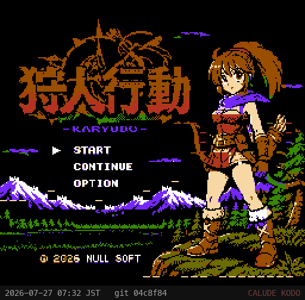
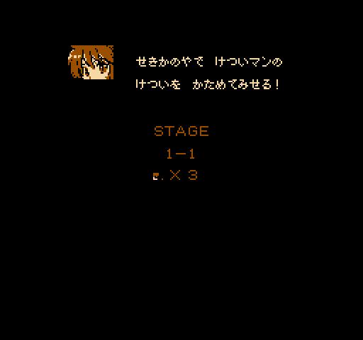
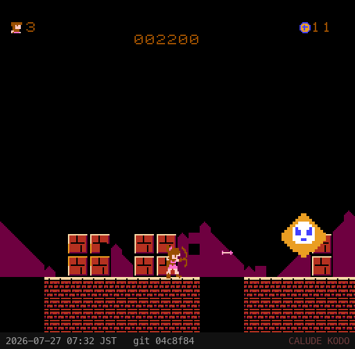

# Calude Kodo (狩人行動)

**English** | [日本語](README.ja.md)

A **side-scrolling action game for the NES (Famicom)** starring a young **huntress**, built from scratch in 6502 assembly (ca65). Developed step by step together with [Claude Code](https://claude.com/claude-code) (Fable 5).

## ▶ [PLAY IN YOUR BROWSER](https://goroman.github.io/cluade-famicom-emu/?pin=0&debug=1&rom=https://raw.githubusercontent.com/GOROman/calude-famicom-game/main/roms/50-coin-shine.nes)

*(latest build: roms/50-coin-shine.nes — boots directly in the cluade-famicom-emu WASM emulator)*

**🛠 [Stage Editor](https://goroman.github.io/calude-famicom-game/editor/)** — edit stages in the browser. The URL *is* the save data, and you can export a modified .nes and play it right away

**🎨 [PNG → CHR Converter](https://goroman.github.io/calude-famicom-game/tools/png2chr/)** — convert images into NES CHR data (.byte / .chr) with 4-color palettes

**🖌 [CHR-ROM Editor](https://goroman.github.io/calude-famicom-game/tools/chredit/)** — pixel-edit the ROM's tile graphics in the browser. Keyboard-driven (1–4 keys + space), with undo, save/load, and an animation checker. Export a modified .nes and play it

**🎞 [Animation Player](https://goroman.github.io/calude-famicom-game/tools/animplay/)** — loop-play frames extracted from video (32 frames of the huntress) with frame selection and adjustable FPS; the URL is the save data

**👁 [Blink Editor](https://goroman.github.io/calude-famicom-game/tools/blinkedit/)** — pixel-edit the title screen's eye-blink frames with a hardware-accurate preview. Apply the JSON to the assets with `tools/apply_blink.py`

Verification is done on the homemade WASM emulator [cluade-famicom-emu](https://github.com/GOROman/cluade-famicom-emu). (The spellings *calude* / *cluade* are intentional.)







## Story

The world has been conquered by the **Ketsui-Man** ("Resolve Man"). Ketsui-Man resolves. "I'll get serious tomorrow." "This time I'll really do it." "I will absolutely see it through." — He resolves, and then does nothing.

The huntress **Kalyudo** sets out again today. Her weapon is not the bow. It is **action**. She takes down those who only resolve, by actually moving — *Calude Kodo* ("Hunter Action"), a tale of those who act.

## Requirements

- macOS (any OS with cc65 and make works)
- The [cc65](https://cc65.github.io/) toolchain (ca65 / ld65)

```sh
brew install cc65
```

## Build

```sh
make          # builds game.nes (iNES format, Mapper 3 / CNROM, 16KB CHR)
make run      # serves cluade-famicom-emu locally and opens it in a browser
make clean
```

After `make run`, load `game.nes` via "Open ROM" in the browser.
(You can also load it directly into the [web emulator](https://goroman.github.io/cluade-famicom-emu/).)

## Controls

| Action | NES | Keyboard (cluade-famicom-emu) |
|------|-----|------|
| Move left / right | D-pad ← → | Arrow keys ← → |
| Jump (height varies with press length) | A | X |
| Bow (up to 2 arrows on screen) | B | Z |
| Pause | START | Enter |

## Tech Notes (highlights)

- **Game loop**: input → update → shadow OAM ($0200) in the main loop; OAM DMA in the NMI (vblank)
- **Jump physics**: SMB-style variable jump — 8.8 fixed-point Y velocity, weak gravity while A is held on the way up, strong gravity after release
- **Player**: 16x32 metasprite (8 hardware sprites), pose-based tile layout arranged as a visual grid in CHR (vertical neighbor = +16) so it can be edited as-is in the CHR-ROM editor
- **Scrolling**: two vertically-mirrored nametables used as a ring, SMB-style column streaming (one 30-tile column uploaded per NMI)
- **Title screen**: full-screen illustration using **CNROM (mapper 3) bank switching** plus a **sprite-0-hit raster split** (PT0→PT1) to break the 256-tile limit; the round screen reuses the same trick to show the title face on its bottom half via a mid-frame CHR bank switch
- **Checkpoint**: a mid-stage flag saves the respawn point (the only meta-column that has ground in all four stages)
- **Stages**: 1-1 to 1-4, each with its own palette mood (blue night → dusk purple → deep teal → showdown crimson) and an accelerating BGM tempo (8/7/7/6 frames per step)
- **Sound**: homemade TR-808-style driver — DPCM kick/snare synthesized in Python, noise hi-hat with software envelopes, TB-303-style triangle bass with portamento and vibrato; two songs plus SFX overlaid onto the BGM registers every frame

See the [Japanese README](README.ja.md) for the full technical notes and roadmap.

## Dev Diary

Essay-style development diaries (in Japanese) live in [docs/diary/](docs/diary/README.md), covering every step from "the day the sky turned blue" to raster splits, sprite sheets, and checkpoint flags.

## License

MIT
